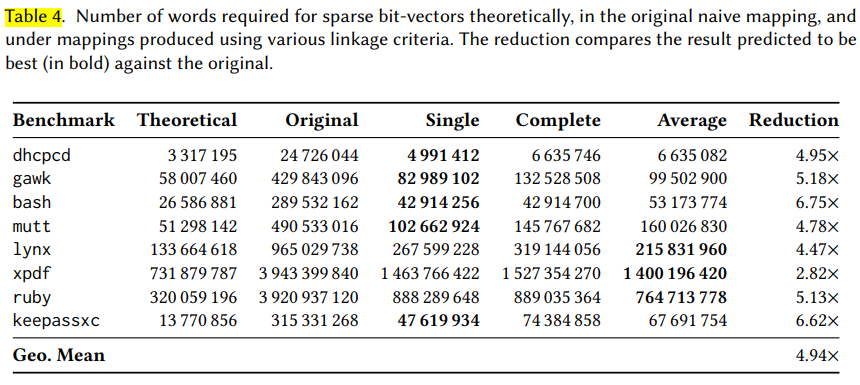

# Compacting Points-To Sets through Object Clustering论文报告

## 一. 论文概述

## 二. 论文详解


## 三. 代码讲解  

## **代码内容**

### **1. 代码概述**
&emsp;&emsp;本论文并没有提出一个新的源代码分析框架，只是对指针分析的PointToSet的表示方式进行改进。所以本论文的代码是在SVF框架上进行一定改动，将论文内容嵌入SVF框架中，对指针分析的PointToSet部分进行了一定的改动。论文代码的ReadMe文件中提到：代码的主要改动为三个部分——CoreBitVector、NodeIDAllocator和PointsTo。后面的代码讲解就主要关注这三个部分。

### **2. CoreBitVector**
&emsp;&emsp;这部分代码包含两个代码文件CoreBitVector.h和CoreBitVector.cpp，主要内容是CoreBitVector和CoreBitVectorIterator这两个类，分别实现了CBV及其迭代器。从类的层次结构来看，CoreBitVectorIterator是CoreBitVector的内部类

(1) CoreBitVector

&emsp;&emsp;CoreBitVector类是CBV的代码实现，一个CoreBitVector对象代表一个CBV。该类对CBV的结构实现如下代码所示：
```C++
class CoreBitVector
{
    public:
    typedef unsigned long long Word;// 一个Word代表64bit

    // ......省略

    private:
    // The first bit of the first word.
    // CBV中第一个有效word(非0word)的第一个有效bit在整个CBV中的偏移量
    unsigned offset;
    // Our actual bit vector.
    // 存储第一个有效word及其之后的word
    std::vector<Word> words;
}
```
&emsp;&emsp;此外，该类实现了大部分的集合运算，如：交(&=)、并(|=)、差(-=)等，足以支持SVF框架中的指针分析。  

(2) CoreBitVectorIterator  

&emsp;&emsp;CoreBitVectorIterator类实现了CBV的迭代器，结构实现的代码如下：
```C++
class CoreBitVectorIterator
{
    //.......省略

    private:
    /// CoreBitVector we are iterating over.(当前CoreBitVector)
    const CoreBitVector *cbv;
    /// Word in words we are looking at.(当前CoreBitVector中的当前Word)
    std::vector<Word>::const_iterator wordIt;
    /// Current bit in wordIt we are looking at(当前Word中的bit偏移量)
    /// (index into *wordIt).
    unsigned bit;
};
```
&emsp;&emsp;该类实现的方法包含了基本的迭代器功能，如：解引用(*)、自增(前置/后置++)、赋值(=)等。使用该迭代器对CoreBitVector对象进行迭代，可以得到CoreBitVector对象所蕴含的CBV信息，即CBV有哪些位置被置1。

### **3. NodeIDAllocator**
&emsp;&emsp;这部分代码包含两个代码文件NodeIDAllocator.h和NodeIDAllocator.cpp，主要内容是NodeIDAllocator和Clusterer这两个类。从类的层次结构来看，Cluster是NodeIDAllocator的内部类。这部分的代码所实现的主要功能是聚类算法中的聚类以及代码运行过程中对各值、对象的编号分配。

(1) NodeIDAllocator  
&emsp;&emsp;这个类实现的是对值、对象的编号分配，根据策略不同会有不同的分配方式(DENSE、SEQ和DEBUG)，而其中有一类GepObject比较特殊，在DEBUG策略中的编号分配方式会有所变化。

(2) Cluster  
&emsp;&emsp;Cluster，顾名思义就是实现了聚类算法的类，但是在该论文提供的代码中，该类只提供在DENCE编号分配策略下的聚类。这个类实现的重要方法有：regionObjects(根据指针流向图划分有关联的对象)、getDistanceMatrix(得到聚类算法中所需要的距离矩阵，存储各节点(值或对象)间距离)、traverseDendogram(利用深度优先搜索遍历聚类树，依次得到各个叶子结点)、evaluate(评估使用不同类型PonitToSet(原始BV、离散BV等)的效果)、cluster(根据节点编号进行聚类)、getReverseNodeMapping(反映射cluster()函数的聚类结果)

### **4. PointsTo**
&emsp;&emsp;这部分代码包含两个代码文件PointsTo.h和PointsTo.cpp，包含PointsTo和PointsToIterator两个类(PointsToIterator是PointsTo的内部类)。这部分代码的主要作用就是表示一个PointToSet。总体而言这部分代码并没有太多的新内容，主要是将表示一个PointToSet所需要的内容整合起来。首先，一个PointsTo类需要确定PointToSet的类型(BV/SBV/CBV)，然后根据这个类型选择PointsTO类中用以表示BitVector的对象(暂称bv)及PointsToIterator中的迭代器(暂称It)。PointsTo中实现的各函数基本都是调用bv中对应的函数，相应地，PointsToIterator中的函数基本也是调用It的相应函数。此外，PointsTo类还会存储聚类的映射及反映射。  

## **代码运行**
### **1. 运行结果** 
  


### **2. 论文结果**
  
  
  


### **3. 结果比对与分析**  
(1) 相同  
&emsp;&emsp;比对我们的运行结果与论文给出的实验结果，可以发现在没有发生OOM(内存溢出)和OOT(超时)的情况下，两者的数据基本一致，这说明我们小组使用论文给出的代码可以基本复现出作者的实验结果。

(2) 不同  
&emsp;&emsp;在部分论文结果有数据的位置，我们的复现结果为"--"或者"OOM"，导致这种情况的原因是运行内存不足。论文的实验环境是100G的运行内存，我们小组在复现时使用的是个人电脑，只能在15G运行内存的环境下进行运行，无法分析论文中给出的一些待分析源码样例。


## 4. 见解


## 5. 成员分工  
<br>
<br>
<br>
<br>
<br>
<br>
<br>
<br>


# **后面是废案，不够字数再挑一点填上去**


## 1. CoreBitVector
这部分包含两个代码文件：CoreBitVector.h和CoreBitVector.cpp，这两个文件主要定义了两个类：CoreBitVector、CoreBitVectorIterator，分别代表CoreBitVector及其迭代器  

(1) CoreBitVector和CoreBitVectorIterator的结构实现：  

- CoreBitVector

```C++
class CoreBitVector
{
    public:
    typedef unsigned long long Word;// 一个Word代表64bit

    // ......省略

    private:
    /// The first bit of the first word.(第一个word的第一个有效bit的偏移量)
    unsigned offset;
    /// Our actual bit vector.(实际上的BitVector)
    std::vector<Word> words;
}
```
在这个类中，一个CoreBitVector可能由多个word组成，用一个类型为vector&lt;Word&gt;的words变量按Word的前后顺序进行存储。Word代表unsigned long long类型，所以一个Word代表64bit的BitVector片段。  
<font color="red">需要注意的是：</font>  每一个word是按照**从右到左**的顺序进行计数的，这个在后面分析CoreBitVectorIterator的函数时会有所体现。  
offset变量表示BitVector中第一个有效位的位置：words[0]不一定BitVector中的第一个word，若某个BitVector的前若干个word都是0，则会占用大量无用内存，此时只需记录第一个非零位在整个BitVector中的位置即可。

- CoreBitVectorIterator

```C++
class CoreBitVectorIterator
{
    //.......省略

    private:
    /// CoreBitVector we are iterating over.(当前CoreBitVector)
    const CoreBitVector *cbv;
    /// Word in words we are looking at.(当前CoreBitVector中的当前Word)
    std::vector<Word>::const_iterator wordIt;
    /// Current bit in wordIt we are looking at(当前Word中的bit偏移量)
    /// (index into *wordIt).
    unsigned bit;
};
```
CoreBitVectorIterator中包含三个变量cbv，wordIt，bit，这三个变量在三个层级进行定位从而指向当前所指向的bit。

- 示意图
  


(2) CoreBitVectorIterator的函数
 
- 构造
```C++
// Returns an iterator to the beginning of cbv if end is false, and to the end of cbv if end is true.  
// 参数end控制返回头部迭代器还是尾部迭代器 
CoreBitVectorIterator(const CoreBitVector *cbv, bool end=false): cbv(cbv), bit(0)
{
    // 根据参数返回相应的迭代器
    // 此时wordIt指向第一个word  或  最后一个word的后面
    wordIt = end ? cbv->words.end() : cbv->words.begin();

    // If user didn't request an end iterator, or words is non-empty,
    // from 0, go to the next bit. But if the 0 bit is set, we don't
    // need to because that is the first element.
    //    如果返回的是头部迭代器    且     头部word的第一位不为1
    if (wordIt != cbv->words.end() && !(cbv->words[0] & (Word)0b1)) ++(*this);// 迭代器移到第一个被设为1的位的位置(++运算符的重载后面会提到)
}

```

注意该函数中的if语句的第二个判断条件cbv->words[0] & (Word)0b1，这里体现了word内部的bit顺序是**从右往左**数：这里是判断头部word的第一位是否为1，而0b1是最右边一位为1。

- ++it运算符重载
```C++
/// Pre-increment: ++it.
const CoreBitVectorIterator &operator++(void)
{
    assert(!atEnd() && "CoreBitVectorIterator::++(pre): incrementing past end!");

    ++bit;// 在当前word中指向位的下标+1
    // Check if no more bits in wordIt. Find word with a bit set.
    // 若该word的第bit位无效(bit超出word的长度或第bit位未置位)，
    // 则寻找下一个不为0的word并将bit置为0
    if (bit == WordSize || (*wordIt >> bit) == 0)
    {
        // 找到下一个word
        bit = 0;
        ++wordIt;
        // 开始找第一个非0word直至该BitVector结束
        while (wordIt != cbv->words.end() && *wordIt == 0) ++wordIt;
    }

    // Find set bit if we're not at the end.
    if (wordIt != cbv->words.end())
    {
        // 找到该word第一个为1的位的下标
        while (bit != WordSize && (*wordIt & ((Word)0b1 << bit)) == 0) ++bit;
    }

    return *this;
}
```
此处while语句中的第二个判断条件也说明word的顺序是**从右往左**进行计数的： 
该while语句是为了找到第一个设为1的位的下标，通过将0b1**左移**对不同的位进行搜索

- *解引用运算符
```C++
/// Dereference: *it.
const unsigned operator*(void) const
{
    assert(!atEnd() && "CoreBitVectorIterator::*: dereferencing end!");
    size_t wordsIndex = wordIt - cbv->words.begin();
    // Add where the bit vector starts (offset), with the number of bits
    // in the passed words (the index encodes how many we have completely
    // passed since it is position - 1) and the bit we are up to for the
    // current word (i.e., in the n+1th)

    //  CoreBitVector的起始偏移             被指向位在当前word中的位置
    return cbv->offset + wordsIndex * WordSize + bit;// 返回该迭代器所指向位在BitVector中所代表的的位置
    //               完全横跨的word的总位数大小
}
```

(3) CoreBitVector的函数

- |=运算符重载  
集合的并运算在指针分析中具有重要作用，所以这里着重关注|=运算符，CoreBitVector通过该运算符进行并运算。  
该函数将CoreBitVector(后称本CBV)与另一CoreBitVector(后称另CBV)进行或运算，会改变本CBV的值。**若CoreBitVector的内容发生改变，则返回true，否则返回false**
```C++
bool CoreBitVector::operator|=(const CoreBitVector &rhs)
{
    // 若本CBV不包含任何word，则直接将另CBV赋值给本CBV
    if (words.size() == 0)
    {
        *this = rhs;
        // 若另CBV也不包含任何word，则本CBV没有变化
        return words.size() != 0;
    }

    // 若另CBV内容为空，则本CBV不会改变
    if (rhs.words.size() == 0) return false;

    // 本CBV与另CBV为同一个对象，本CBV不会改变
    if (this == &rhs) return false;

    // 下面两行是对本CBV和另CBV所表示范围进行适配，使两者相同
    // TODO: some redundancy in extendTo calls.
    // 另CBV的最后一位下标f_idx_2大于本CBV，则需要对本CBV进行扩展，从末尾一直到f_idx_2填充0
    if (finalBit() < rhs.finalBit()) extendForward(rhs.finalBit());
    // 本CBV的第一位下标offset大于另CBV，则需要对另CBV进行扩展，从offset开始填充0
    if (offset > rhs.offset) extendBackward(rhs.offset);

    // Start counting this where rhs starts.
    // 找到另CBV的首位偏移在本CBV的第几个word中，从而方便word的对应
    const size_t thisIndex = indexForBit(rhs.offset);
    size_t rhsIndex = 0;

    // Only need to test against rhs's size since we extended this to hold rhs.
    // 分别找到本CBV与另CBV相互对应的第一个word的指针
    Word *thisWords = &words[thisIndex];
    const Word *rhsWords = &rhs.words[rhsIndex];
    const size_t length = rhs.words.size();
    Word changed = 0;

    // Can start counting from 0 because we took the addresses of both
    // word vectors at the correct index.
    // 从另CBV的头开始向尾部遍历
    #pragma omp simd
    for (size_t i = 0 ; i < length; ++i)
    {
        const Word oldWord = thisWords[i];
        // Is there anything in rhs not in *this?
        // 更新本CBV
        thisWords[i] = thisWords[i] | rhsWords[i];
        // 新旧本CBV对比查看是否有改变
        changed |= oldWord ^ thisWords[i];
    }

    return changed;
}
```

## 2. NodeIDAllocator